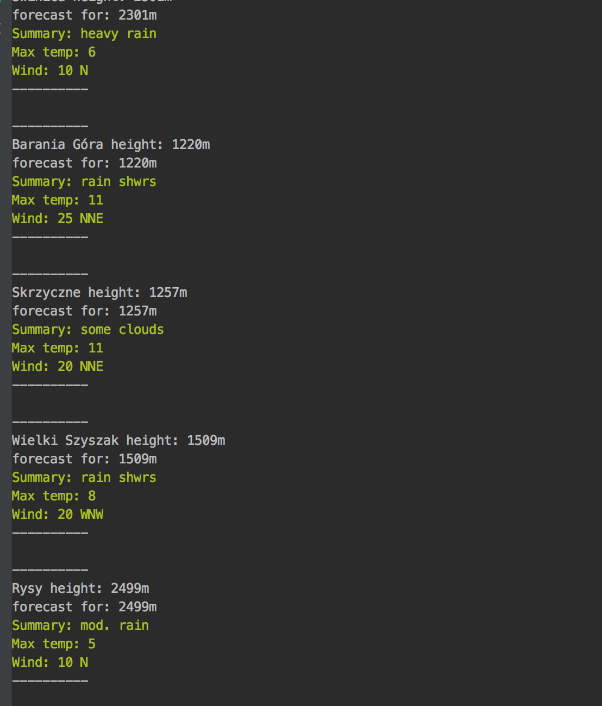

### Portal społecznościowy na potrzeby środowiska alpinistów i wspinaczy wysokogórskich
#### *Paweł Zawodny*

* [PDF](https://github.com/pawelzawodny/Praca-Magisterska/blob/master/Mgr.pdf)

## Update 2.0
Aplikacja gotowa w swojej 1 wersji rozwojowej.
Całość zotała przepisana na nowy framework, dodany zostal modul fornt-endowy napisany w Angular2.
Efekty mozna zobaczyc na heroku pod adresem: https://weatherviewer.herokuapp.com/
Jeśli chodzi o odpalenie projektu lokalnie to odpalamy npm install w folderze projektu a nastepnie w folderze FRONT.
W pliku views/app.config.ts usawiamy odpowiedni lokalny adres ip do polaczenia z API.
W pliku config/mysql.js ustawiamy odpowiednie parametry polaczenia do lokalnej bazy mysql.
W obu projektach odpalamy npm start i pod odpowiednim adresem powinnismy zobaczyc dzialajaca aplikacje.

## Update 1.0

Crawler używa modułu request.
Baza danych to MongoDB.
Crawler opiera się na liście urli do Państw, które zapisane są w bazie danych.
Następnie przeprowadzana jest iteracja po wszystkich szczytach dostępnych dla danego Państwa.
Każdy nowy szczyt jest zapisywany w bazie z informacją o jego wysokości i lokalizacji.
Dla każdego szczytu oraz każdej dostępnej jego wysokości pobierana jest prognoza pogody.
Z racji słabej czytelności tabeli i faktu, że wyniki są pokazywane zawsze najświeższe na dany moment, trzeba tłumaczyć je na przybliżone daty.
Zapisywane są wiatr, temperatury, opady, wysokość pokrywy lodowej, wschód i zachód słońca.
Skanowanie państwa trwa ok 10s.

### Wprowadzenie:

Jako aktywny wspinacz, alpinista i podróżnik niemalże na co dzień stykam się z problemami jakie dotykają ludzi integrujących się wokół tych, bądź co bądź niecodziennych zainteresowań.
Każdy z nas, na co dzień, metodą prób i błędów opracował sobie własne sposoby na ich rozwiązywanie.
Podczas organizacji tak dużego przedsięwzięcia jakim jest np wyprawa wysokogórska, wiele z pozoru błahych niedogodności urasta do rangi niedopatrzenia, które na pewno potrafi skutecznie uprzykrzyć czas podczas wyjazdu, a w skrajnych przypadkach może przesądzić nawet o powodzeniu całej wyprawy.
Takie problemy mogą być bardzo różne i zazwyczaj zależą od formy aktywności górskiej.

W przypadku organizowania dużych ekspedycji w góry wysokie jedną z najważniejszych jest trudność w optymalnym doborze członków zespołu. Często są to przedsięwzięcia na tyle duże pod względem organizacyjnym, że trudno jest się opierać jedynie na gronie najbliższych znajomych.
Organizatorzy stają więc przed dużym wyzwaniem odpowiedniego doboru uczestników pod kątem danej wyprawy. Pod uwagę wziąć należy zarówno aspekty związane z doświadczeniem i technicznymi umiejętnościami kandydata jak i jego cechy osobowościowe.
Jeżeli więc przychodzi nam dokonać tak odpowiedzialnego wyboru spośród ludzi, których znamy w bardzo niewielkim stopniu, to powstaje konkretny problem, w rozwiązaniu którego z pomocą może przyjść nam technologia.

Kolejnym aspektem na który chciałbym zwrócić uwagę w tym opracowaniu są prognozy pogody.
Na wstępie należy zaznaczyć, że alpinista planujący wysokogórską wspinaczkę potrzebuje prognoz znacznie różniących się od tych jakie większość z nas zna z internetowych portali informacyjnych czy telewizji. Żeby podejmować właściwe decyzje, wspinacz potrzebuje bardzo dokładnych danych pogodowych, dodatkowo powiązanych z konkretną wysokością na zdobywanej górze. W internecie istnieje tylko jeden liczący się serwis, który dostarcza odpowiednich prognoz.
Problem polega na tym, że jego użyteczność po odejściu od komputera w domowym zaciszu spada prawie do zera. Analizowanie prezentowanych tam danych, na wyjeździe, na ekranie smartphone’a jest praktycznie niemożliwe. Nie wspominając już o fakcie dostępności takich danych w miejscach bez dostępu do internetu, co w górach jest sytuacją zupełnie oczywistą.
Przy pomocy serwisu, który automatycznie przygotuje i wyśle do użytkownika żądaną prognozę pogody, chciałbym zaproponować rozwiązanie takiego problemu.

W serwisie znajdują się też mniej lub bardziej typowe dla sieci społecznościowych funkcjonalności, które w założeniu mają ułatwić komunikację pomiędzy członkami środowiska wspinaczkowego, dostarczyć im narzędzia do planowania wypraw i urzeczywistniania swoich pomysłów.
W kolejnym etapie rozwoju, chciałbym aby serwis stał się swojego rodzaju inkubatorem i źródłem uporządkowanej wiedzy na temat wszystkich, najbardziej popularnych destynacji wspinaczkowych.

#### Bibliografia

Michael Hartl, Aurelius Prochazka: RailsSpace: Building a Social Networking Website with Ruby on Rails. Addison-Wesley Professional, 2007. ISBN 0321480791.

Jonathan Strickland, How to Start a Social Networking Site, [dostęp 25.09.14]
http://computer.howstuffworks.com/internet/social-networking/information/start-social-networking-site.htm

Hendrickson, Mark. Nine Ways to Build Your Own Social Network. TechCrunch. 24.06.2007.
http://www.techcrunch.com/2007/07/24/9-ways-to-build-your-own-social-network/
